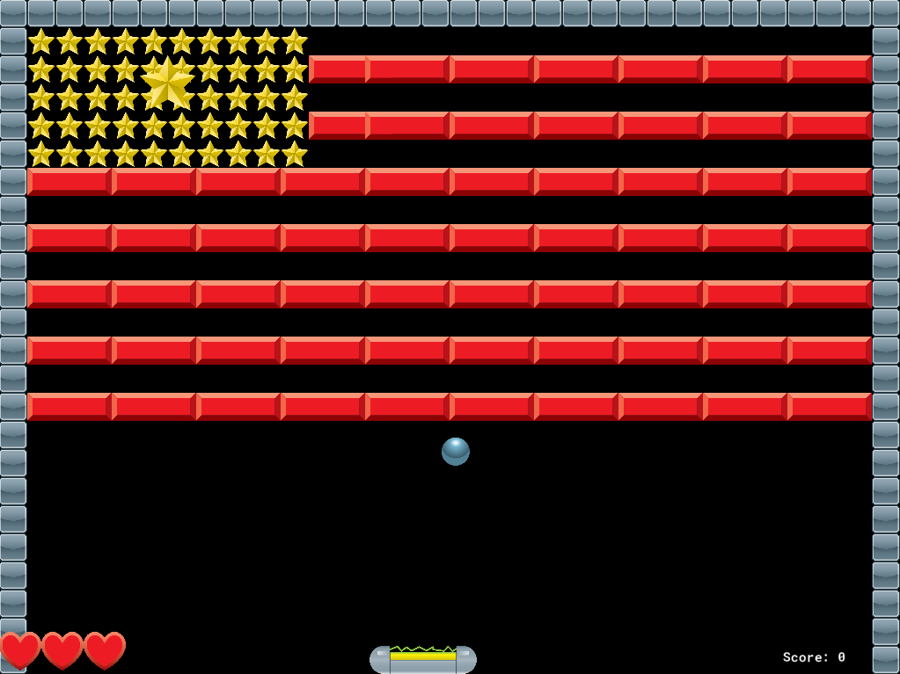
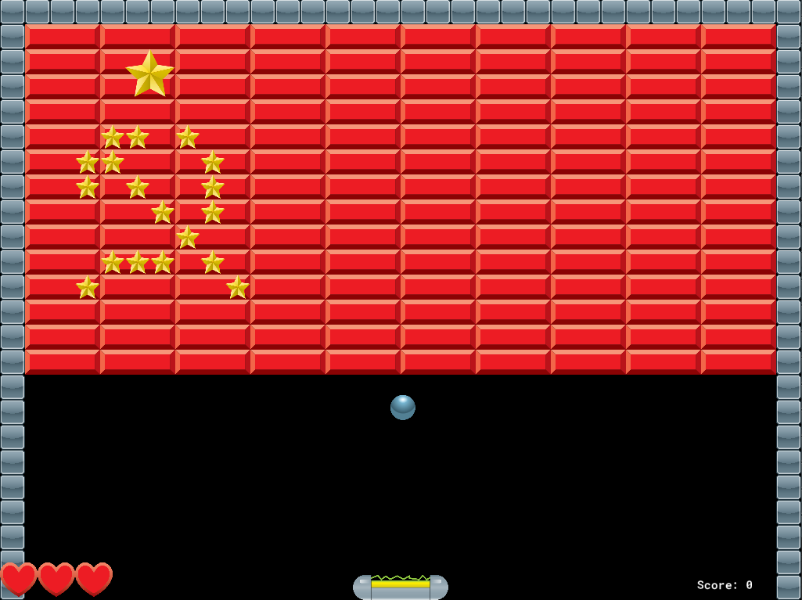

# Brick-Breaker
Fourth GameMaker Studio 2 project for my CIT160 course (Game and Simulation Programming)

## Purpose
Learn more about GameMaker and level design

## Summary
The player must smash a wall of bricks by deflecting a bouncing ball with a paddle

## Goal
Collect all the stars to advance to the next level

